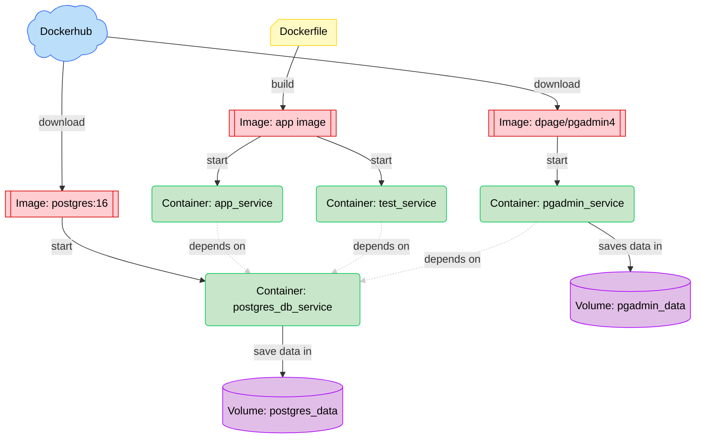

Dette projekt er et setup til data engineering projekter, hvor der bruges python, pytest og postgreSQL.

Projektet er sat op med Docker, Docker Compose og Dev Container.

Der er også sat en pgAdmin container op, hvor forbindelsen til postgres databasen er præ-konfigureret.

# Setup Guide
## Installer WSL og Docker Desktop

### Windows Subsystem for Linux (WSL)

Docker skal bruge WSL for at kunne køre. For at installere det:
1. Åben PowerShell som Administrator.
2. Brug kommandoen ``wsl --install``
3. Genstart din computer
4. Åben igen PowerShell
5. Verificer installationen med kommandoen ``wsl --version``

### Docker Desktop

1. Download Docker Desktop til windows fra https://www.docker.com/products/docker-desktop/
2. Installer Docker Desktop
3. Åben docker desktop
4. Åben PowerShell og brug kommandoen ``docker --version`` for at verificere at installationen er korrekt
5. Brug kommandoen ``docker run hello-world``. Du har nu startet din første Docker container.

---
---

# Container system overview

Systemet består af 4 containers:
- ``app_service`` containeren kører app koden 
- ``test_service`` containeren kører tests for app koden
- ``postgres_db_service`` containeren kører databasen
- ``pgadmin_service`` containeren kører pgAdmin applikationen

``app_service`` og ``test_service`` containerene bliver begge startet fra ``app_image``, der bliver bygget ud fra ``Dockerfile``. ``postgres_db_service`` og ``pgadmin_service`` bliver startet fra images (``postgres:16`` og ``dpage/pgadmin4``) hentet fra Docker Hub.

Data fra databasen i ``postgres_db_service`` bliver gemt i ``postgres_data`` volume. ``pgadmin_service`` gemmer config data i ``pg_admin`` volume.

---
## Fil overview
- ``app`` mappen indeholder alt applikations koden. Når docker starter applikationen starter den ``app/main.py`` så det anbefales at køre alt i sin applikation gennem ``app/main.py``, da man ellers skal lave om i Docker og Docker Compose setup for at få det til at køre.
- ``tests`` mappen indenholder alle test, som bliver kørt af ``test_service`` containeren. Der er to under mapper:
	- ``tests/unit`` mappen indeholder alle unit tests, som er test af kode indenfor jeres applikation.
	- ``tests/integration`` mappen indeholder integration tests. Det er test af forbindelsen til andre systemer. Lige nu er der en test, der tjekker forbindelsen til Postgres databasen.
- ``.gitignore`` filen er en text fil, der beskriver hvilke filer og fil typer, der ikke skal skubbes til git.
- ``dockerignore`` filen er en text fil, der beskriver hvilke filer, der ikke skal kopieres ind i docker images
- ``requirements.txt`` er text fil, der lister alle de libraries, der skal bruges til at køre applikationen.
- ``requirements-dev.txt`` er en text fil, der lister alle de libraries, der skal bruges til at køre testene, men ikke bruges til at køre applikationen.
- ``.devcontainer`` mappen indeholder config filer til Dev Container
- ``pgadmin`` mappen indeholder config filer til pgAdmin

---
---
# Startup guide

## Lav .env fil
- I projektets root, skal du lave en ny fil, der hedder ``.env``, den indeholder miljø variabler for projektet. ``.env`` filen indeholder hemmeligheder som koder eller tokens, som ikke skal deles offentligt af sikkerhedshensyn. ``.env`` er derfor inkluderet i ``.gitignore``, så de ikke bliver synced med git.
- De følgende miljøvariable (environment variables) skal sættes i ``.env``. ``POSTGRES_HOST=db`` og ``POSTGRES_PORT=5432`` skal ikke ændres, men resten af værdierne er vilkårlige.

```
POSTGRES_DB=postgres_db

POSTGRES_USER=admin

POSTGRES_PASSWORD=password

POSTGRES_HOST=db

POSTGRES_PORT=5432

PGADMIN_USER_EMAIL=admin@example.com

PGADMIN_PASSWORD=password
```

---
## Dev container

En af udfordringerne med Docker, er at ens IDE ikke har adgang til ens dependencies og pakker. Det betyder, den kan vise fejl i ens kode pga. manglende installationer, selvom dette ikke vil være et problem ved runtime, da de der vil være installeret i ens container. Man kan heller ikke bruge intellisense fra ens pakker i IDE'en.

Løsningen er en Dev Container, som er en Docker container, hvor ens dependencies are installeret som man kan åbne VS Code i. For at åbne projektet i en dev container:
1. Installer ``Dev Containers`` extension i VS Code
2. Tryk ``ctrl`` + ``shift`` + ``p`` for at få command pallete frem
3. Brug kommandoen ``Dev Containers: Reopen in Container``
	- Dette skridt kan godt tage et stykke tid første gang
4. Nede i venstre hjørne af VS Code vil der nu være et blåt mærke, hvor der står ``Dev Container: ...`` op du har nu adgang til dine dependencies.
5. For at lukke dev containeren, åben command pallete (``ctrl`` + ``shift`` + ``p``) og brug kommandoen ``Dev Containers: Reopen Folder Locally``

---
## Start og stop applikationen

1. Sørg for at Docker Desktop er åben i baggrunden
2. Åben terminalen i projektets root mappe
3. Brug kommandoen ``docker compose up --build app``
	- ``postgres:16`` image bliver hentet fra Docker Hub *(ved første kørsel)* og ``postgres_db_service`` containeren bliver startet
	- ``app image`` bliver bygget ud fra ``Dockerfile`` og ``app_service`` containeren bliver startet ud fra ``app_image``
        - *(``app_image`` bliver kun genbygget, hvis der er sket ændringer, der nødtvendigøre det pga. caching)*
4. Brug kommandoen ``docker compose down``
	- ``postgres_db_service`` containeren og ``app_service`` containeren bliver stoppet.

---
## Køre testene

1. Sørg for at Docker Desktop er åben i baggrunden.
2. Åben terminalen i projektets root,
3. Brug kommandoen ``docker compose run --build --rm tests``
	- ``postgres:16`` image bliver hentet fra Dockerhub *(ved første kørsel)* og ``postgres_db_service`` containeren bliver startet.
	- ``app image`` bliver bygget ud fra ``Dockerfile`` og ``test_service`` containeren bliver startet ud fra ``app image``
	- ``test_service`` containeren lukker automatisk efter kørsel pga. ``--rm`` flaget.
4. Brug kommandoen ``docker compose down``
	- ``postgres_db_service`` containeren bliver nu stoppet. 
		- *(Den bliver automatisk startet, når ``test_service`` containeren bliver startet, men den bliver ikke automatisk stoppet, da flere containers, ex. ``app_service``, kunne være afhængig af den.)*

---
## pgAdmin

pgAdmin er et værktøj til at administrere postgreSQL databaser. Det kan være praktisk til at visualisere ens database og konstruere queries.

Der er en pgAdmin container sat up i projektet. For at åbne den:
1. Åben terminallen i projektets root
2. Brug kommandoen ``docker compose up -d pgadmin``
3. Åben din browser og gå ind på http://localhost:8080/. Det kan godt tage lidt tid at få forbindelse
4. Login med pgAdmin credentials fra ``.env`` filen
5. Forbindelsen til databasen er allerede konfigureret. Når du connecter med databasen vil du blive promptet til at indtaste et password. Det er postgres passwordet fra ``.env`` filen

---
---
# Libraries

Fordi projektet køres og udvikles i Docker containere, skal der ikke installeres nogen libraries lokalt. Istedet, skal de listes i ``requirements.txt`` filen, så bliver de automatisk inkluderet i ens Docker image. Når man har lagt et nyt library ind i ``requirements.txt`` er det en god ide at genbygge og genstarte ens dev container med command pallete kommandoerne:
- ``Dev Containers: Reopen Folder Locally``
- ``Dev Containers: Rebuild and Reopen in Container``

Det er forresten best practice at lave **version pinning** i sin ``requirements.txt`` fil. Det betyder at man istedet for at referere en pakke f.eks. ``pandas``, så refererer man en specifik version af pandas f.eks. ``pandas==3.0.5``. Det sikrer, at det samme version bliver brugt i hver build for consistency.

---
---
# Docker / Docker Compose kommandoer

- **Start ``app_service``:** ``docker compose up --build app``
- **Kør ``test_service``:** ``docker compose run --build --rm tests``
- **Stop services:** ``docker compose down``
- **Stop services og slet volumes:** ``docker compose down -v``
- **Start ``pgadmin_service``:** ``docker compose up -d pgadmin``
- **Se alle containers:** ``docker compose ps -a``
- **Se alle images:** ``docker image ls``
- **Slet alle images:** ``docker image prune -a``
- **Se alle volumes:** ``docker volume ls -a``